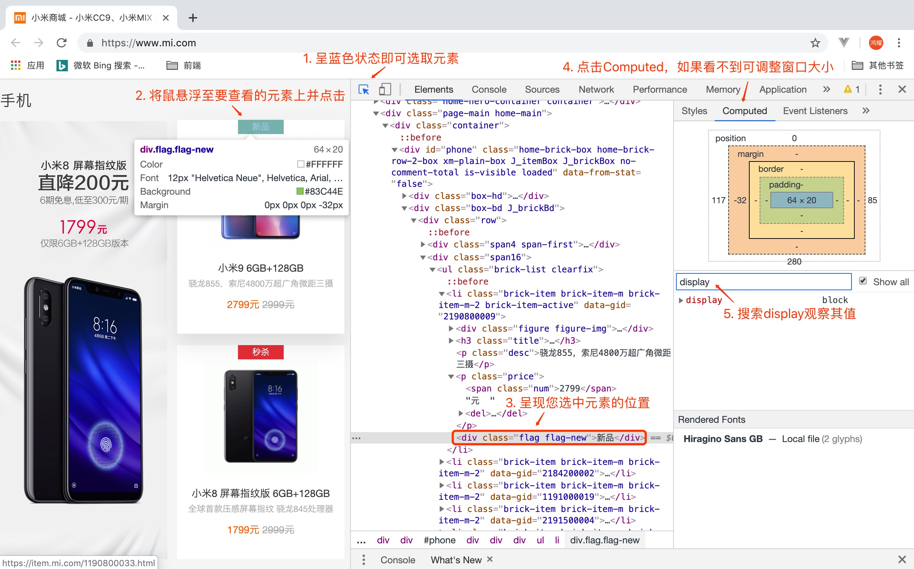

# 一、前言

一个基本的网站包含很多个网页，一个网页由` HTML`, `CSS` 和 `JavaScript`  组成。

- HTML：结构层，决定网页的结构和内容（ “是什么”）
- CSS：渲染层，设定网页的表现样式（ “长啥样”）
- JavaScript：行为层，控制网页的行为（ “做什么”）
如果把一个网页比喻成一栋楼 **HTML** 是这做座楼的组成要素，决定了这坐楼有多少层，每层有多少个房间，每个房间有多少门，多少窗子，都有什么家具。 **CSS** 就是这座楼的设计要素，决定房间有多高，墙面涂什么颜色，家具摆在什么位置等等。 **JavaScript**是这座楼的电气自动化等设备，可以让人和大楼进行自动交互，提高便捷性和舒适性。   

# 二、什么是HTML？

HTML（Hyper Text Markup Language） ，即超文本标记语言。HTML 不是一种编程语言，而是一种标记语言 (markup language)，标记语言由一系列标签组成，通过标记标签来描述网页。

# 三、HTML标签

```html
<a href="https://www.baidu.com">跳转至百度首页</a>
```

HTML 标记通常被称为 HTML 标签 (HTML tag)。

- HTML 标签是由尖括号包围的关键词，如：`<a>`
- HTML 标签通常是成对出现的，如：`<a> </a>`
- 标签对中的第一个标签（`<a>`）被称为开始标签，第二个标签（`</a>`）被称为结束标签
- 开始和结束标签也被称为开放标签和闭合标签

> 提示：在HTML中标签名是不区分大小写的，也就是说一个标签既可以全部写成大写的英文字母，也可以全部写成小写的英文字母（主流的写法），如：“\<head>”写成“\<HEAD>”，“\<body>”写成“\<BODY>”都不会影响页面的正常运行。甚至还可以将一个标签元素的英文字母大小混写都是不影响页面正常运行的，但这种做法会影响代码的可读性，并不推荐。

# 四、属性

```html
<a href="https://wwwbaidu.com" target="_blank">点击前往</a>
```

上述代码定义了一个 **a** 标签（超链接），该标签拥有 `href` 及 `target` 属性，提供了链接地址以及在什么窗口下打开新的页面，标签中的文本为呈现在页面上的内容。
HTML 标签可以拥有属性，属性提供了有关HTML标签的更多属性，属性总是以 `属性名=属性值` 的形式出现，或者称作为键（`key`）值（`value`）对的形式，即：`key = "value"`，如：`title = 'HTMLTest'`，属性一般定义在开始标签中。

属性特点：
- 等号左边属性，右属性值。
- 属性值一般用引号，数字值无需引号
- 元素可以有多个属性，属性之间用空格隔开
- 部分属性的属性值仅为一些预定值，也称为枚举值。例如link中的media，只能设置为all,screen,print
- 部分属性可以没有属性值，即属性值本来就为布尔值。也可以把属性值写为属性加上引号，例如`<input type="text" required>`，也可以写成`<input type="text" required="required">`

# 五、元素

HTML 元素指的是从开始标签（start tag）到结束标签（end tag）的所有代码，即元素由开始标签、结束标签、属性以及显示内容组成。


# 六、标签嵌套

所谓标签的嵌套，是指一个标签对以内包含另外一个标签，如：\<html>标签内包含\<head>和\<body>两个标签对，而\<head>标签内又可以包含\<meta>和\<title>等标签。也就是说标签不仅可以单独存在，又可以包含其它一个或多个标签，而且标签的嵌套可以是多层的，并且嵌套层数是没有限制的。

标签的嵌套根据代码规范性、性能和SEO（搜索引擎优化）等方面考虑，应当遵循以下规则：

- HTML页面中所有需要显示在浏览器窗口内的内容均需要放置在\<body>标签对以内。
- 在不影响页面显示、CSS样式设置和DOM操作的前提下，标签的嵌套层数是越少越好。
- 标签嵌套的基本顺序应该是：“*块级标签*>*行内块标签*>*行内标签*”。
- 同一个显示类型的标签可以进行嵌套，如：“块级标签>块级标签”、“行内块标签>行内块标签”和“行内标签>行内标签”。
- 避免使用“行内标签”去嵌套“行内块标签”和“块级标签”、“行内块标签”去嵌套“块级标签”，虽然有的时候在显示上并不会出现问题，但“行内标签”大部分是不具备布局属性的，需要进行显示类型转换（*display*）才能够进行CSS的布局设置，既麻烦，又不规范。

# 七、HTML 基本文档结构

HTML基本文档结构是指组成一个基本的HTML页面所必须的元素标签。具体编写格式如下：

```html
<!DOCTYPE html>
<html lang="zh-CN">
    <head>
        <meta charset="UTF-8">
        <title>Document</title>
    </head>
    <body></body>
</html>
```

## `< html>`
HTML文件最基本的标签，在一些新版本的浏览器中没有该标签也能显示出HTML内的内容，但是为了兼容更多的浏览器还是应该避免这种“缺斤少两”的行为（除非该页面是通过Ajax异步导入到一个公共页内的，那外层的所有标签都可以省略，只用保留`<body>`标签内的内容），通常编辑器会将里面的“lang”属性的值设为“en”，这时用带自动翻译的浏览器（如Google Chrome）打开会识别到该属性值，从而询问用户是否翻译。因而，若网站面向的是中国客户，可以将该属性设置为“zh”或“zh-cn”。
由于该标签是HTML文档中最基本的标签，所以它反而是一个非常容易被开发经验不足的开发者所忽略的标签，它在页面中也会根据自身的内容来调整占据浏览器内的高度，也可以设置CSS样式，这在以后的项目开发中要稍加留心，特别是做页面CSS样式初始化的时候要注意。
##  `<head>`

用于放置网页基本信息的标签，需要包含`<meta>`标签和`<title>`标签对，可包含外部文件引入的标签，如：`<style>`标签对、``<link>标签和`<script>`标签对。

### 1.`<meta>`
不包含任何内容，并且没有结束标签。它是通过对应的属性来设置编码格式（必要）、设备显示缩放、搜索引擎关键字、描述、浏览器内核渲染方式等内容。[\<参考文献\>](https://segmentfault.com/a/1190000002407912)
基本用法：

* 设置网页的关键字
```html
<meta name="keywords"  content="HTML5,CSS,JavaScript,前端" />
```
* 指定网页的描述
``` html
<meta name="description"  content="你好，我是这个网页的描述" />
```
* 做请求的重定向
``` html
<meta http-equiv="refresh"  content="秒数;url=目标路径" />
```
### 2.`<title>`
不需要设置任何属性，只需包含纯文本内容，用于显示网页明显，在浏览器端会将该标签内设置的文本内容显示于浏览器标签页上，也是网页在搜索引擎中最重要的内容，会直接影响在搜索引擎中的排名。


### 3.`<style>`
在该标签对内通过选择器设置页面内标签元素的样式。在HTML5规范中已不需要设置属性，若考虑到兼容性，通常需要加上样式类型说明的属性
```html
<style type="text/css"></style>
```

### 4.`<link>`

该标签没有结束标签，用于导入外部文件。但目前的浏览器主要支持两种文件的引入方式，即外部样式表和浏览器标签上的图标。该标签主要支持两种属性：
- rel：定义引入文件的类型。
- href：指定引入文件所在的路径。
### 5.`<base>`

该标签为页面上的所有链接（路径）规定默认地址或默认目标，使开发者不必重复地去设置那些相同的链接路径和超链接的打开方式，它有两个属性：
- href：规定页面中所有相对链接的基准URL。
- target：规定页面中所有超链接的默认打开方式，这个属性在“HTML超链接”章节的内容中会讲到。

### 6.`<script>`

在HTML5的规范中，该标签不需要加上任何属性，默认支持Javascript的执行，老版本的IE浏览器需要加上属性`<script type="text/javascript">`。在以前，这个标签通常是放置于`<head>`标签对以内的，后来很多前端工程师发现，将该标签放置于文档末尾，也就是`</body>`结束标签之后（`</html>`结束标签之前）更利于提升HTML文档的加载显示速度。到现在，这种做法已经成为了一种主流的做法。
### `<body>`

该标签为HTML文档在浏览器内显示内容的标签，它定义了内容的显示类型，无论通过什么外部方式去进行控制和设置，最终都是通过`<body>`标签对将内容交付给浏览器进行渲染，也就是说如果没有`<body>`标签对内的内容，在浏览器端将是一片“苍白”，见不到任何实质性的内容。
HTML中所有的文本、基本标签、表单标签、`<canvas>`标签、超链接、图像、音频、视频等有实质内容的标签都赢放置于`<body>`内，否则浏览器内核将不能正确的渲染并最终显示。

## 注释

我们经常要在一些代码旁做一些HTML注释,这样做的好处很多,比如:
* 方便项目组里的其它程序员了解你的代码
* 方便以后你对自己代码的理解与修改
* 注释不会显示在页面中
可以在HTML文档中加入自己的注释。它可以用来提醒网页设计人员回忆相关的程序信息。注释行的写法如下：
`<!-- 注释的内容  -->`


# 八、元素分类 *

HTML 元素分为块级元素（`block`）、行内元素（`inline`）以及行内块元素（`inline-block`），三种元素类型的特性如下：

- 块级元素：单独占一行，具备盒子模型，即可设置宽度和高度；
- 行内元素：不独占一行，不具备盒子模型，即不可设置宽度和高度，大小由内容决定；
- 行内块元素：不独占一行，具备盒子模型，即不可设置宽度和高度；

> 提示：对于块级元素而言，即使你设置了宽高，其也会独占一行。

**如何判断一个元素的类型？**

在谷歌浏览器中鼠标右键检查元素，然后通过元素选取器选取要查看元素类型的元素，最后在computed中搜索display属性观察其值即可。如下所示：



# 文档流

所谓文档流就是HTML文档中可显示元素在排列时所占用的位置。HTML文档流中的标签元素遵循“从左到右、从上到下”的排列次序，有如现代汉字的书写顺序一样，但又存在着一些差别。
